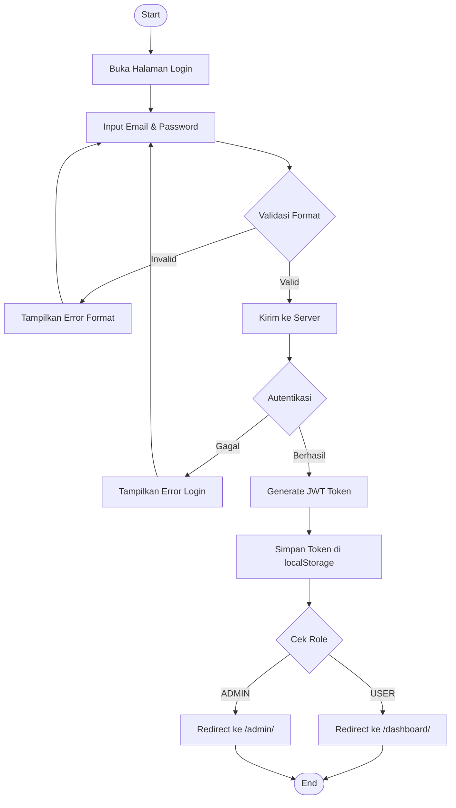
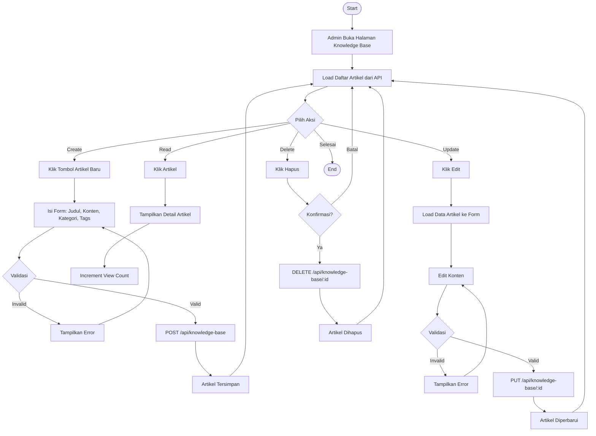

# Flowchart Proses Screening — LunarHealth Platform

> Alur lengkap proses self-screening menggunakan metode Fuzzy Tsukamoto

## Flowchart Utama — Proses Self-Screening

```mermaid
flowchart TD
    A([🟢 Start]) --> B[User Login / Autentikasi]
    B --> C{Sudah Login?}
    C -->|Belum| D[Redirect ke Halaman Login]
    D --> B
    C -->|Sudah| E[Buka Halaman Self-Screening]

    E --> F["📋 Input Data Pribadi<br/>(Step 1: Data Diri)"]
    F --> F1["• Usia<br/>• Jenis Kelamin<br/>• Berat Badan (kg)<br/>• Tinggi Badan (cm)"]
    F1 --> G["🚬 Input Data Kebiasaan<br/>(Step 2: Kebiasaan Merokok)"]
    G --> G1["• Status Perokok Aktif<br/>• Jumlah Batang/Hari<br/>• Durasi Merokok (tahun)<br/>• Perokok Pasif?"]
    G1 --> H["🩺 Input Data Kesehatan<br/>(Step 3: Kondisi Kesehatan)"]
    H --> H1["• Durasi Batuk (bulan)<br/>• Riwayat Keluarga Kanker<br/>• Paparan Lingkungan (1-10)<br/>• Skala Nyeri Dada (1-10)"]

    H1 --> I{Validasi Input}
    I -->|❌ Invalid| J[Tampilkan Error Validasi]
    J --> F
    I -->|✅ Valid| K[Hitung BMI Otomatis]

    K --> L["🧮 PROSES AI — FUZZY TSUKAMOTO"]

    subgraph FuzzyProcess["⚙️ Mesin Fuzzy Tsukamoto"]
        direction TB
        L --> M["1️⃣ Fuzzifikasi<br/>Ubah data crisp → derajat keanggotaan"]
        M --> M1["Variabel Input:<br/>• Usia → Muda/Paruh Baya/Tua<br/>• Rokok/Hari → Ringan/Sedang/Berat<br/>• Durasi Merokok → Pendek/Menengah/Panjang<br/>• BMI → Kurus/Normal/Gemuk/Obesitas<br/>• Durasi Batuk → Pendek/Menengah/Panjang<br/>• Paparan Lingkungan → Rendah/Sedang/Tinggi<br/>• Nyeri Dada → Ringan/Sedang/Berat"]
        M1 --> N["2️⃣ Evaluasi Aturan Fuzzy<br/>Evaluasi seluruh rule IF-THEN"]
        N --> N1["Contoh Rule:<br/>IF rokok=Berat AND usia=Tua<br/>AND batuk=Panjang<br/>THEN risiko=Sangat_Tinggi"]
        N1 --> O["3️⃣ Inferensi Tsukamoto<br/>Hitung z (nilai crisp) tiap rule<br/>menggunakan fungsi keanggotaan output"]
        O --> P["4️⃣ Defuzzifikasi<br/>Weighted Average:<br/>z* = Σ(αi × zi) / Σ(αi)"]
    end

    P --> Q["📊 Hitung Skor Risiko (0-100)"]
    Q --> R{Klasifikasi Kategori}

    R -->|"0 - 25"| S1["🟢 RENDAH<br/>Risiko minimal"]
    R -->|"26 - 50"| S2["🟡 SEDANG<br/>Perlu perhatian"]
    R -->|"51 - 75"| S3["🟠 TINGGI<br/>Segera konsultasi"]
    R -->|"76 - 100"| S4["🔴 SANGAT TINGGI<br/>Darurat medis"]

    S1 --> T["💡 Generate Rekomendasi<br/>Berbasis Kategori Risiko"]
    S2 --> T
    S3 --> T
    S4 --> T

    T --> T1["Kategori Rekomendasi:<br/>• Lifestyle<br/>• Medical Checkup<br/>• Diet<br/>• Exercise<br/>• Mental Health<br/>• Emergency"]

    T1 --> U["💾 Simpan ke Database<br/>(Screening + Recommendations)"]
    U --> V["📄 Tampilkan Halaman Hasil"]
    V --> W{Aksi Selanjutnya?}

    W -->|"Lihat Detail"| X[Halaman Detail Hasil]
    W -->|"Download PDF"| Y[Export Hasil PDF]
    W -->|"Screening Lagi"| E
    W -->|"Dashboard"| Z[Kembali ke Dashboard]

    X --> AA([🔴 End])
    Y --> AA
    Z --> AA

    classDef start fill:#dcfce7,stroke:#22c55e,stroke-width:2px
    classDef process fill:#dbeafe,stroke:#2563eb,stroke-width:1px
    classDef decision fill:#fef3c7,stroke:#f59e0b,stroke-width:2px
    classDef fuzzy fill:#ede9fe,stroke:#8b5cf6,stroke-width:1px
    classDef riskLow fill:#dcfce7,stroke:#22c55e,stroke-width:2px
    classDef riskMed fill:#fef9c3,stroke:#eab308,stroke-width:2px
    classDef riskHigh fill:#ffedd5,stroke:#f97316,stroke-width:2px
    classDef riskCrit fill:#fee2e2,stroke:#ef4444,stroke-width:2px
    classDef endNode fill:#fee2e2,stroke:#ef4444,stroke-width:2px

    class A start
    class B,E,F,G,H,K,T,U,V,X,Y,Z process
    class C,I,R,W decision
    class L,M,N,O,P fuzzy
    class S1 riskLow
    class S2 riskMed
    class S3 riskHigh
    class S4 riskCrit
    class AA endNode
```

## Flowchart Pendukung — Proses Autentikasi

## Flowchart Pendukung — CRUD Knowledge Base (Admin)

## Keterangan Simbol

| Simbol | Makna |
|--------|-------|
| ⬭ (Rounded Rectangle) | Start / End |
| ▭ (Rectangle) | Proses / Aktivitas |
| ◇ (Diamond) | Decision / Keputusan |
| ⬡ (Hexagon) | Sub-proses Fuzzy AI |
| →  (Arrow) | Alur proses |
| - - → (Dashed Arrow) | Alur opsional / include/extend |
