# Use Case Diagram — LunarHealth Self-Screening Platform

> Sistem AI Deteksi Dini & Klasifikasi Tingkat Risiko Kanker Paru-Paru bagi Perokok Aktif

## Diagram

```mermaid
graph TB
    subgraph Sistem["🏥 LunarHealth Platform"]
        direction TB

        subgraph AuthSystem["Modul Autentikasi"]
            UC1["Registrasi Akun"]
            UC2["Login"]
            UC3["Lupa Password"]
            UC4["Reset Password"]
        end

        subgraph UserModule["Modul Pengguna"]
            UC5["Melihat Dashboard Pribadi"]
            UC6["Melakukan Self-Screening"]
            UC7["Melihat Hasil Pemeriksaan"]
            UC8["Melihat Riwayat Pemeriksaan"]
            UC9["Melihat Rekomendasi Kesehatan"]
            UC10["Mencatat Konsumsi Rokok Harian"]
            UC11["Mengelola Profil"]
            UC12["Mengubah Pengaturan Akun"]
            UC13["Membaca Knowledge Base"]
            UC14["Export Hasil ke PDF"]
        end

        subgraph AdminModule["Modul Pengelola"]
            UC15["Melihat Dashboard Analytics"]
            UC16["Mengelola Data Pengguna CRUD"]
            UC17["Mengelola Knowledge Base CRUD"]
            UC18["Melihat Riwayat Pemeriksaan Semua User"]
            UC19["Mengelola Aturan Fuzzy CRUD"]
            UC20["Melihat Variabel Fuzzy"]
            UC21["Melihat Analisis Distribusi Risiko"]
            UC22["Export Data Pemeriksaan CSV"]
            UC23["Mengelola Pengaturan Sistem"]
        end

        subgraph AIEngine["Mesin AI Fuzzy Tsukamoto"]
            UC24["Fuzzifikasi Input"]
            UC25["Evaluasi Aturan Fuzzy"]
            UC26["Defuzzifikasi"]
            UC27["Klasifikasi Tingkat Risiko"]
            UC28["Generate Rekomendasi Otomatis"]
        end
    end

    User(("👤 User<br/>Perokok Aktif"))
    Admin(("👨‍💼 Admin<br/>Pengelola"))

    %% User connections
    User --> UC1
    User --> UC2
    User --> UC3
    User --> UC5
    User --> UC6
    User --> UC7
    User --> UC8
    User --> UC9
    User --> UC10
    User --> UC11
    User --> UC12
    User --> UC13
    User --> UC14

    %% Admin connections
    Admin --> UC2
    Admin --> UC15
    Admin --> UC16
    Admin --> UC17
    Admin --> UC18
    Admin --> UC19
    Admin --> UC20
    Admin --> UC21
    Admin --> UC22
    Admin --> UC23

    %% Internal system relationships
    UC6 -.->|"triggers"| UC24
    UC24 -.->|"feeds"| UC25
    UC25 -.->|"feeds"| UC26
    UC26 -.->|"produces"| UC27
    UC27 -.->|"triggers"| UC28
    UC28 -.->|"outputs to"| UC7

    %% Include/Extend
    UC6 -.->|"<<include>>"| UC2
    UC7 -.->|"<<include>>"| UC6
    UC8 -.->|"<<include>>"| UC2
    UC14 -.->|"<<extend>>"| UC7
    UC4 -.->|"<<extend>>"| UC3

    classDef actor fill:#dbeafe,stroke:#2563eb,stroke-width:2px,color:#1e40af
    classDef userUC fill:#f0fdf4,stroke:#22c55e,stroke-width:1px
    classDef adminUC fill:#fef3c7,stroke:#f59e0b,stroke-width:1px
    classDef aiUC fill:#ede9fe,stroke:#8b5cf6,stroke-width:1px
    classDef authUC fill:#f1f5f9,stroke:#64748b,stroke-width:1px

    class User,Admin actor
    class UC5,UC6,UC7,UC8,UC9,UC10,UC11,UC12,UC13,UC14 userUC
    class UC15,UC16,UC17,UC18,UC19,UC20,UC21,UC22,UC23 adminUC
    class UC24,UC25,UC26,UC27,UC28 aiUC
    class UC1,UC2,UC3,UC4 authUC
```

## Deskripsi Aktor

| Aktor | Deskripsi |
|-------|-----------|
| **User (Perokok Aktif)** | Pengguna umum yang melakukan self-screening untuk mendeteksi risiko kanker paru-paru |
| **Admin (Pengelola)** | Administrator sistem yang mengelola data pengguna, knowledge base, aturan fuzzy, dan memantau statistik |

## Daftar Use Case

### Modul Autentikasi
| ID | Use Case | Aktor |
|----|----------|-------|
| UC1 | Registrasi Akun | User |
| UC2 | Login | User, Admin |
| UC3 | Lupa Password | User |
| UC4 | Reset Password | User |

### Modul Pengguna (User)
| ID | Use Case | Deskripsi |
|----|----------|-----------|
| UC5 | Melihat Dashboard Pribadi | Statistik screening, tracker rokok, chart profil risiko |
| UC6 | Melakukan Self-Screening | Mengisi form data kesehatan untuk diproses AI |
| UC7 | Melihat Hasil Pemeriksaan | Skor risiko, kategori, detail fuzzy, rekomendasi |
| UC8 | Melihat Riwayat Pemeriksaan | Daftar seluruh screening yang pernah dilakukan |
| UC9 | Melihat Rekomendasi Kesehatan | Saran lifestyle, medical checkup, diet, exercise |
| UC10 | Mencatat Konsumsi Rokok Harian | Input jumlah rokok per hari + AI warning |
| UC11 | Mengelola Profil | Ubah nama, email, foto, data personal |
| UC12 | Mengubah Pengaturan Akun | Ubah password, preferensi notifikasi |
| UC13 | Membaca Knowledge Base | Membaca artikel edukasi kesehatan paru |
| UC14 | Export Hasil ke PDF | Download hasil screening dalam format PDF |

### Modul Pengelola (Admin)
| ID | Use Case | Deskripsi |
|----|----------|-----------|
| UC15 | Melihat Dashboard Analytics | Total user, screening, distribusi risiko, tren |
| UC16 | Mengelola Data Pengguna (CRUD) | Lihat, edit, hapus data pengguna |
| UC17 | Mengelola Knowledge Base (CRUD) | Create, Read, Update, Delete artikel edukasi |
| UC18 | Melihat Riwayat Pemeriksaan Semua User | Telusuri seluruh data screening + filter + export |
| UC19 | Mengelola Aturan Fuzzy (CRUD) | Create, Read, Update, Delete rules fuzzy |
| UC20 | Melihat Variabel Fuzzy | Lihat konfigurasi variabel input/output |
| UC21 | Melihat Analisis Distribusi Risiko | Epidemiologi: distribusi kategori risiko + tren |
| UC22 | Export Data Pemeriksaan (CSV) | Download data screening dalam format CSV |
| UC23 | Mengelola Pengaturan Sistem | Konfigurasi sistem, maintenance |

### Mesin AI Fuzzy Tsukamoto (Internal)
| ID | Use Case | Deskripsi |
|----|----------|-----------|
| UC24 | Fuzzifikasi Input | Mengubah data crisp menjadi derajat keanggotaan |
| UC25 | Evaluasi Aturan Fuzzy | Mengevaluasi seluruh aturan IF-THEN |
| UC26 | Defuzzifikasi | Menghitung nilai output crisp (weighted average) |
| UC27 | Klasifikasi Tingkat Risiko | Memetakan skor ke kategori (Rendah/Sedang/Tinggi/Sangat Tinggi) |
| UC28 | Generate Rekomendasi Otomatis | Menghasilkan rekomendasi berdasarkan kategori risiko |
